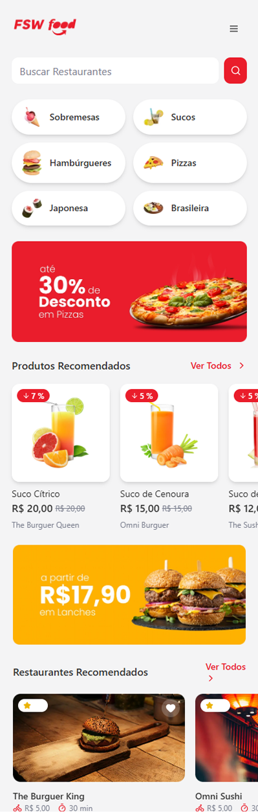
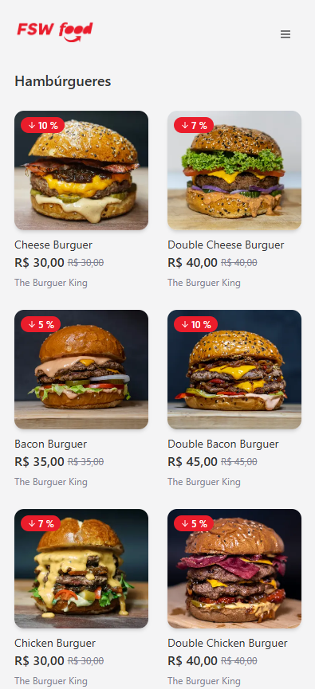
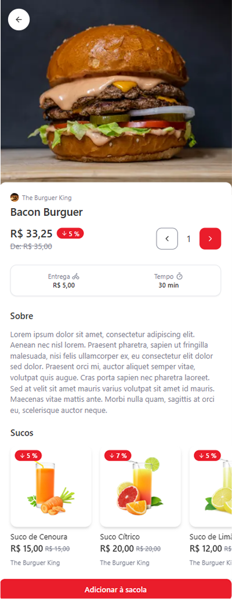
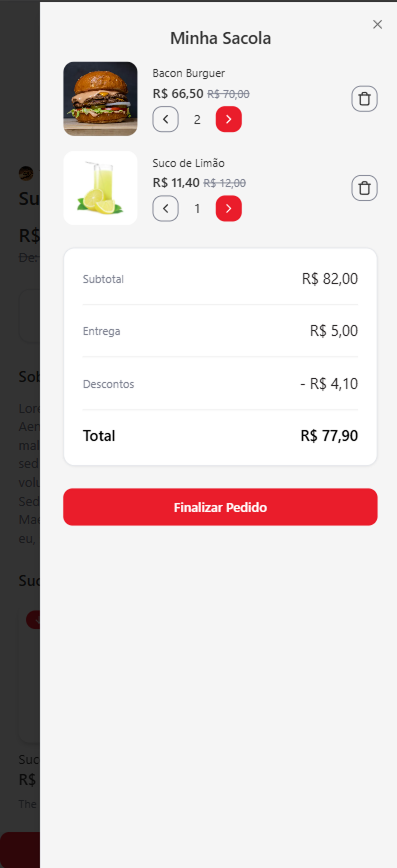

# FSW Foods

**Template completo de restaurante/delivery — mobile first**

<div align="center">

### Mobile

| Home                                                        | Categorias                                                              | Detalhe do Produto                                                      | Sacola                                                        |
| ----------------------------------------------------------- | ----------------------------------------------------------------------- | ----------------------------------------------------------------------- | ------------------------------------------------------------- |
|  |  |  |  |

</div>

---

<div align="center">

[](https://nextjs.org)
[](https://react.dev)
[](https://www.typescriptlang.org)
[](https://tailwindcss.com)
[](https://prisma.io)
[](https://ui.shadcn.com)

</div>

---

### Tech Stack

- **Next.js 14.2.31** (App Router)
- **React 18** + **TypeScript 5**
- **Tailwind CSS 3.4.1** + `tailwindcss-animate`
- **shadcn/ui** (Dialog, Sheet, Card, Button, Separator)
- **Prisma 6.13.0** + PostgreSQL (com seed via `ts-node`)
- **lucide-react** para ícones

---

### Comandos que foram usados

```bash
# Prisma
npm install prisma --save-dev
npx prisma init --datasource-provider postgresql
npx prisma migrate dev --name init_database
npx prisma db seed        # executa ./prisma/seed.ts
```

# shadcn/ui

npx shadcn@latest init
npx shadcn@latest add card button sheet dialog separator

# Formatação

npm install -D prettier prettier-plugin-tailwindcss
